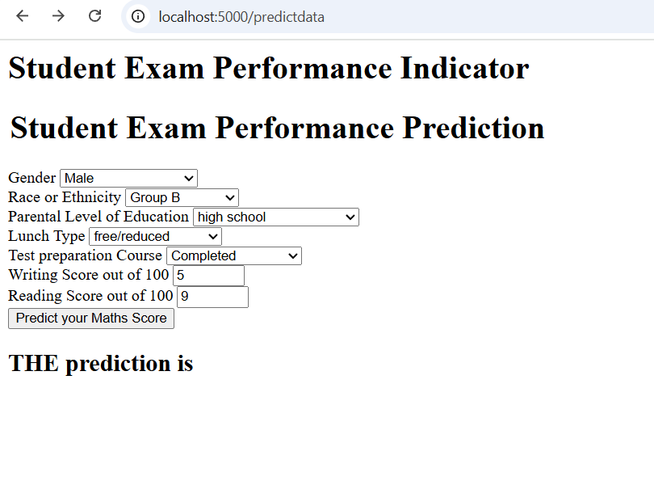

## End to end machine learning project

### Project Overview
This project aims to build a predictive model that estimates a student's academic performance based on key personal and behavioral features—specifically gender, age, and study hours. By analyzing these inputs, the model can forecast expected scores, helping educators and learners identify patterns that influence academic success.




## Installation Guide
#### Follow these steps to set up and run the application:

### 1.Clone the Repository:

   ```bash
   git clone https://github.com/sanchit-yadav/mlproject.git
   ```


### 2.Create a Virtual Environment: Make sure you have a virtual environment set up for your project.

### 3.Install Dependencies: Install the required dependencies using the requirements.txt file:

  
You can copy the following command and run it in your terminal:

```bash
pip install -r requirements.txt
```

#### 4.Run the Application: To start the app, execute the following command in your terminal:
```bash
python app.py
```